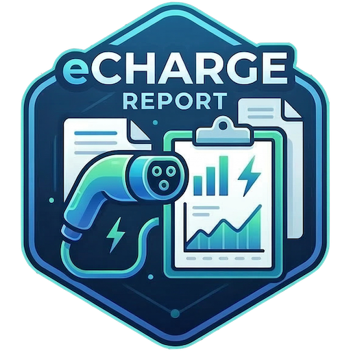

[](https://codecov.io/gh/szilch/echarge-report)



# echarge-report

CLI tool for interacting with **wallbox charging stations** — fetch real-time status and generate charging reports (terminal or PDF).

## 1. Overview

`echarge-report` is a flexible tool to easily gather insights and generate reports from your wallbox charger.

**Supported Wallboxes:**

- **go-e Charger** (Cloud API v3 and Local API)
- More wallbox types coming soon! The architecture supports easy extension via adapters.

**Feature Overview:**

- **Real-time Status**: Fetch the current state of your go-e Charger.
- **Detailed Reports**: Generate charging reports for specific months or date ranges.
- **PDF Export**: Easily export tabular charging reports into a neat PDF document.
- **Merge PDFs**: Automatically append existing PDFs (e.g. your electricity contract `.pdf` files) to the generated report.
- **RFID Filtering**: Filter your charging sessions by specific RFID chip IDs or names.
- **Mail Support**: Send generated PDFs directly via email.
- **Home Assistant Integration**: Fetch the current mileage of your EV from Home Assistant and include it in your reports.

**Downloads & Packages:**

- [GitHub Releases (Linux, Windows, macOS binaries)](https://github.com/szilch/echarge-report/releases)
- [GitHub Container Registry (Docker Packages)](https://github.com/szilch/echarge-report/pkgs/container/echarge-report)

---

## 2. For Users

### Configuration

Settings are stored in `~/.echarge-report/config.yml` in YAML format. They can also be set using the CLI `config-set` commands (which support nested keys using dot-notation, e.g., `wallbox.goe.cloud.serial`).

#### Environment Variables
All configuration keys can also be set via environment variables. The mapping follows these rules:
1. Prefix with `ECHARGEREPORT_`
2. Convert all dots (`.`) to underscores (`_`)
3. Convert to uppercase

**Example:** `wallbox.goe.cloud.token` becomes `ECHARGEREPORT_WALLBOX_GOE_CLOUD_TOKEN`.

**Wallbox Type Auto-Detection:** You no longer need to explicitly set `wallbox_type`. The tool automatically identifies the wallbox type based on the presence of configuration keys (e.g., if any `wallbox.goe.*` keys are set, it defaults to `goe`).

**Important:** For go-e chargers, you must configure either the **Cloud API** (`wallbox.goe.cloud.token` and `wallbox.goe.cloud.serial`) OR the **Local API** (`wallbox.goe.local.apiUrl`).

#### General Settings

| Parameter / Key | Requirement | Description                                                     |
| --------------- | ----------- | --------------------------------------------------------------- |
| `chipIds`       | Optional    | Comma-separated list of RFID chips to filter (e.g., `1,MyChip`) |
| `licenseplate`  | Optional    | License plate to show on the report                             |
| `kwhprice`      | Optional    | Price per kWh (e.g., `0.38`)                                    |

#### go-e Charger Settings (Nested under `wallbox.goe`)

| Parameter / Key           | Requirement          | Description                                                     |
| ------------------------- | -------------------- | --------------------------------------------------------------- |
| `wallbox.goe.cloud.token` | **Required (Cloud)** | Your Wallbox Cloud API Token                                    |
| `wallbox.goe.cloud.serial`| **Required (Cloud)** | Your wallbox serial number                                      |
| `wallbox.goe.local.apiUrl`| **Required (Local)** | The URL to your local Wallbox API (e.g., `http://192.168.1.50`) |

#### Home Assistant Settings (Nested under `smarthome.homeassistant`)

| Parameter / Key                            | Requirement | Description                                                  |
| ------------------------------------------ | ----------- | ------------------------------------------------------------ |
| `smarthome.homeassistant.api`              | Optional    | Home Assistant URL (e.g., `http://homeassistant.local:8123`) |
| `smarthome.homeassistant.token`            | Optional    | Home Assistant Long-Lived Access Token                       |
| `smarthome.homeassistant.milage_sensorid`  | Optional    | HA Sensor ID for mileage (e.g., `sensor.car_mileage`)        |

#### Mail Settings (Nested under `mail`)

| Parameter / Key | Requirement | Description                      |
| --------------- | ----------- | -------------------------------- |
| `mail.host`     | Optional    | SMTP Mail Host                   |
| `mail.port`     | Optional    | SMTP Mail Port (e.g., `587`)     |
| `mail.username` | Optional    | SMTP Username                    |
| `mail.password` | Optional    | SMTP Password                    |
| `mail.from`     | Optional    | Sender Email                     |
| `mail.to`       | Optional    | Comma-separated recipient emails |

### Command Line Interface (CLI)

```bash
# Configuration setup commands
./bin/echarge-report config-set wallbox.goe.cloud.token YOUR_API_TOKEN
./bin/echarge-report config-set wallbox.goe.cloud.serial 123456
./bin/echarge-report config-set chipIds chip1,chip2
./bin/echarge-report config-list

# Show current wallbox status
./bin/echarge-report status

# Charging report for the previous month (terminal output)
./bin/echarge-report report

# Charging report for a specific month (terminal output)
./bin/echarge-report report --month=02-2026

# Charging report for a date range (multiple months)
./bin/echarge-report report --from-month=01-2026 --to-month=03-2026

# Filter by RFID chip ID or name
./bin/echarge-report report --month=02-2026 --chipIds=1,MyChip

# Export as PDF
./bin/echarge-report report --month=02-2026 --pdf

# Export as PDF and append all existing PDFs found in ~/.echarge-report/
./bin/echarge-report report --month=02-2026 --pdf --attach-pdfs

# Export as PDF and send it via email (requires mail config)
./bin/echarge-report report --month=02-2026 --pdf --send-mail
```

> **Note:** Only RFID tags configured directly on the wallbox can be used for filtering.

### Setup via Docker Compose

You can run `echarge-report` periodically as a cron job inside a lightweight Docker container. There are two ways to configure the container: using environment variables in the `docker-compose.yml` file, or by providing your existing `config.yml` file via a volume mount.

#### Option A: Using Environment Variables (Recommended for pure Docker)

Configure everything directly within your `docker-compose.yml`:

```yaml
version: "3.8"

services:
  echarge-report-cron:
    image: ghcr.io/szilch/echarge-report:latest
    container_name: echarge-report-cron
    restart: unless-stopped
    volumes:
      # Mount a local 'data' directory to attach existing PDFs
      - ./data:/home/echarge-report/.echarge-report
    environment:
      # CRON_EXPRESSION syntax: "min hour day month weekday"
      # Default "0 12 1 * *" generates the report on the 1st of every month at 12:00
      - CRON_EXPRESSION=0 12 1 * *

      # This is the CLI command executed periodically
      - CRON_COMMAND=/app/echarge-report report --pdf --attach-pdfs --send-mail

      # Define your configuration variables here:
      - ECHARGEREPORT_WALLBOX_GOE_CLOUD_SERIAL=your_serial_number
      - ECHARGEREPORT_WALLBOX_GOE_CLOUD_TOKEN=your_cloud_token
```

#### Option B: Using a Configuration File

If you have already configured the tool locally, you can simply reuse your `config.yml` file.
Place your `config.yml` file inside the `./data` folder and mount it into the container. `echarge-report` will automatically read it. You only need to define the CRON variables in your `docker-compose.yml`:

```yaml
version: "3.8"

services:
  echarge-report-cron:
    image: ghcr.io/szilch/echarge-report:latest
    container_name: echarge-report-cron
    restart: unless-stopped
    volumes:
      # The container will read your ./data/config.yml file
      - ./data:/home/echarge-report/.echarge-report
    environment:
      - CRON_EXPRESSION=0 12 1 * *
      - CRON_COMMAND=/app/echarge-report report --pdf --attach-pdfs --send-mail
      # Everything else is read from the mounted config file
```

#### Starting the Container

1. Create the `data` directory next to your `docker-compose.yml`: `mkdir data`
2. If using Option B, copy your config file: `cp ~/.echarge-report/config.yml ./data/`
3. **If using `--attach-pdfs`**: Place all PDF files you want to merge (e.g., your electricity contract) directly into the newly created `./data` directory. The container will automatically pick them up.
4. Start the container in the background:
   ```bash
   docker-compose up -d
   ```
5. Check the logs:
   ```bash
   docker-compose logs -f
   ```

---

## 3. For Developers

### Prerequisites

- [Go](https://go.dev/dl/) v1.18+

### Build & Run

| Command      | Description            |
| ------------ | ---------------------- |
| `make build` | Compile the binary     |
| `make run`   | Compile and run        |
| `make clean` | Remove build artifacts |

```bash
git clone https://github.com/szilch/echarge-report.git
cd echarge-report
make build   # binary is placed in bin/
```

### Docker Build

If you want to build the Docker image locally instead of pulling it from the registry, you can use the Makefile:

```bash
make docker-build
```

### Libraries Used

- [spf13/cobra](https://github.com/spf13/cobra) — CLI framework
- [spf13/viper](https://github.com/spf13/viper) — Configuration management
- [fatih/color](https://github.com/fatih/color) — Colored terminal output
- [jung-kurt/gofpdf](https://github.com/jung-kurt/gofpdf) — PDF generation
- [pdfcpu/pdfcpu](https://github.com/pdfcpu/pdfcpu) — PDF merging and manipulation

## License

[MIT](LICENSE)
